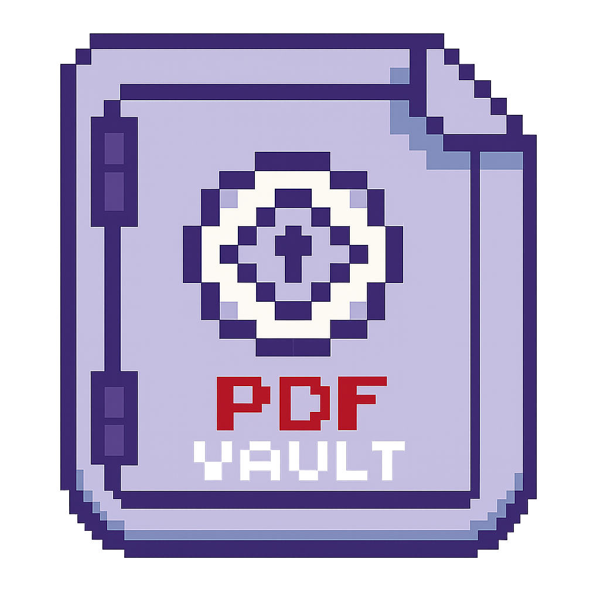

# PDF Vault

A tiny, fast, **100% local** PDF library for macOS. Drop PDFs (or images) in,
and organize, preview, merge, split, edit, and compress them — no accounts,
no cloud, no telemetry.

<p align="center"></p>

<p align="center">
  <a href="https://github.com/BennPhu/pdf-vault/actions/workflows/test.yml"></a>
  <a href="https://github.com/BennPhu/pdf-vault/releases/latest"></a>
  <a href="LICENSE"></a>
</p>

macOS can already merge PDFs — that was never the point. PDF Vault is about
**controlling and editing your PDFs on your own terms, without uploading
them to anyone's cloud**. It sits deliberately between the native PDF tools
and the online ones: more capable and organized than Preview, and 100%
private where the web tools are not.

## Features

- **Library with live search** — drop files in (with a live progress bar on big batches), find them instantly, double-click a name to rename
- **Preview & file info** — flip through any PDF's pages; hover/click the ⓘ for size, dates, dimensions, and PDF metadata
- **Merge / Split** — combine selected PDFs, extract page ranges, or split every page to its own file
- **Edit pages** — rotate or delete pages, drag-and-drop them into a new order, and discard the whole editing session if you change your mind
- **Compress** — shrink bloated or scanned PDFs in place (original kept in trash for undo)
- **Images → PDF** — drop PNG/JPEG/WebP files and they become PDFs in your library
- **Delete with undo/redo** — trashed files auto-purge after 30 days
- **Master PDF** — bind your entire library into one document on demand
- **Activity & stats** — see exactly what the app has done and what it uses, and clear the log anytime

## Privacy

Everything runs on your machine. The only network request PDF Vault ever
makes is an HTTPS update check against GitHub Releases — and updates install
only after SHA-256 verification. Details in [SECURITY.md](SECURITY.md).

## Install

1. Download the latest `PDF-Vault-*-macos.zip` from [Releases](https://github.com/BennPhu/pdf-vault/releases).
2. Unzip and drag **PDF Vault.app** into Applications.
3. First launch: **right-click the app → Open** (one time only).

> **Why the right-click?** The build is currently unsigned — signing requires
> a paid Apple Developer account. The app is open source, so you can audit
> exactly what it does, or build it yourself below. Release zips ship with a
> SHA-256 checksum in the release notes.

If macOS asks for permission to access your storage folder (Documents/Desktop),
click **Allow** — PDF Vault only ever touches the folder you chose.

## Build from source

```bash
git clone https://github.com/BennPhu/pdf-vault.git
cd pdf-vault
python3 -m venv .venv
.venv/bin/pip install -r requirements.txt
.venv/bin/python app.py        # run the app
```

To produce the .app bundle: `pip install -r requirements-dev.txt && ./build.sh`

## Development

```bash
.venv/bin/pip install -r requirements-dev.txt
.venv/bin/ruff check .         # lint — zero-warning policy
.venv/bin/pytest tests/ -v     # test suite
```

## Tech stack

| Layer | Choice |
|---|---|
| Language | Python 3.12 |
| Desktop shell | [pywebview](https://pywebview.flowrl.com/) — native macOS WKWebView, no Electron |
| PDF engine | [PyMuPDF](https://pymupdf.readthedocs.io/) (rendering & thumbnails) + [pypdf](https://pypdf.readthedocs.io/) (page surgery) |
| UI | Hand-written HTML/CSS/JS — zero frameworks, zero build step |
| Packaging | [PyInstaller](https://pyinstaller.org/) → self-contained `.app` bundle |
| Quality | pytest (100+ tests), ruff (zero-warning policy), GitHub Actions CI |

## Project layout

| Path | Purpose |
|---|---|
| `app.py` | pywebview entrypoint + native drag-and-drop |
| `api.py` | JS ↔ Python bridge (every method returns `{ok, ...}`) |
| `pdf_core.py` | All PDF/library logic and storage housekeeping |
| `updater.py` | Checksum-verified auto-updater (GitHub Releases) |
| `web/` | The UI — plain HTML/CSS/JS, no frameworks |
| `tests/` | pytest suite incl. security and code-quality enforcement |

## License

MIT — see [LICENSE](LICENSE).
